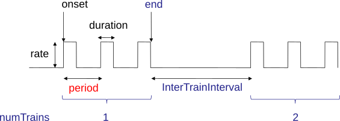
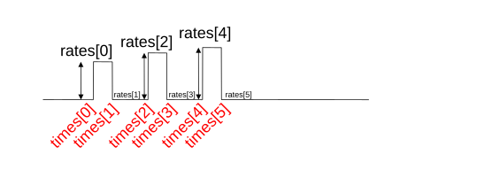

Implementing reaction-diffusion using NeuroRD
=============================================

.. contents::

Model specification format
--------------------------

Six different xml files must be prepared to run a NeuroRD simulation. The master or model file contains parameters for the simulation run and names of the other five files providing data for the simulation. The other five files include morphology, reaction scheme, initial conditions, output definition and stimulation. The reactions scheme file contains names and characteristics of all molecules and reactions in the simulation, including diffusion constants. The morphology file provides details on compartments, such as dendrites, soma and spines. The initial conditions file specifies the beginning amounts and locations of molecules. The stimulation file provides details of signal inputs during the simulation. The output file specifies which molecules are provided as the results. These results, in the form of the number of particles of each type in each element at each timestep, are stored to files for processing once the simulation has completed.

The independent definition of morphology, reactions and stimulation in separate files makes NeuroRD ideal to investigate the interaction of these characteristics in models. For example, the reaction scheme is independent of morphology to facilitate the investigation of the role of morphology, and to allow different morphologies to be investigated with different signaling pathways and vice versa. It is important to note that not all file are independent of each other:
1. Reactions and morphology _are_ independent of each other. These files define the species involved in the simulations and the morphological compartments in which they can be found. Most of the other files depend on these "core model" files.  If these change, it is likely that all subsequent files must change.  However, the subsequent files can be changed yet retain the same reaction and morphology files (this is typically how simulation experiments are performed).
2. Initial conditions depends on the reaction file (where molecule species are defined) and and will depend on morphology when some species are confined to subregions of the model. Changes to these files allow exploration of the role of molecule concentration and localization.
3. Similarly, the stimulation file depends on the reaction file (you can only inject a species already defined) and morphology (you can only inject at a defined regions or labels).
4. The output file clearly depends on species defined in the reaction file.  Output from specific regions depends also on morphology file.

In all files, lines beginning "<!--" are XML comments and can be left out of real model files. Comments are ended with “-->" and can span multiple lines.

Units
~~~~~
Times are expressed in milliseconds and distances in microns. Concentrations are in nanoMoles per litre, but the same quantities may alternatively be set by specifying a number density in particles per square micron (which is almost equivalent - a 1 nM solution averages about 0.6 particles per square micron). Reaction rates are in transitions per millisecond and mobilities are in mu2/s.

Reactions Scheme File
---------------------

The reaction file has two parts. The first part is a listing of all molecule species. There is one program statement for each molecule in which each species is given a name, an id, a diffusion constant, and units for the diffusion constant. Species names can have spaces in them, but the id cannot. The id usually does not have to be specified, the name with spaces and slashes replaced with underscores will be used by default. The format is:

.. code-block:: xml

     <Specie name="name" id="id" kdiff="constant" kdiffunit="mu2/s" />

Two examples follow:

1.  example for diffusing molecule specification:

.. code-block:: xml

     <Specie name="IP3"   kdiff="100"   kdiffunit = "mu2/s"/>

2.  examples for non-diffusing molecule specification:

.. code-block:: xml

     <Specie name="PIP2"  kdiff="0"     kdiffunit = "mu2/s"/>

Reactions
~~~~~~~~~

The second part of the reaction file is a list of all reactions. There are several statements for each reaction. In the first, the reaction is given a name and an id. The reaction names can have spaces in them, but the id cannot. The id usually does not have to be specified, the name with spaces and slashes replaced with underscores will be used by default. The name also doesn't have to be specified: a string of the form A+2×B→C will be used by default. Subsequent statements identify reactants, products, forward reaction rate, reverse reaction rate, and Q10 value. Note, the Q10 is currently not used. Zero or more products can be specified, but at least one reactant is required. The format is:

.. code-block:: xml

    <Reaction name="name" id="id">
        <Reactant specieID="id"/>
        <Product specieID="id"/>
        <forwardRate> rate </forwardRate>
        <reverseRate> rate </reverseRate>
        <Q10> value </Q10>
    </Reaction>

The attribute `specieID=` refers to one of the species declared above, and must match either the
`id` or the `name` of one of the species.
Enzyme reactions are specified as two bimolecular reactions, with the enzyme regenerated in the second step. An example of an enzyme reaction follows:

.. code-block:: xml

    <Reaction>
        <Reactant specieID="PLCaG"                         />
        <Reactant specieID="PIP2"                       />
        <Product  specieID="PLCPIP2"                      />
        <forwardRate> 0.83e-06              </forwardRate>
        <reverseRate> 0.1e-03              </reverseRate>
        <Q10>                   0.2                     </Q10>
    </Reaction>

    <Reaction>
        <Reactant specieID="PLCPIP2"                      />
        <Product  specieID="PLCaG"                         />
        <Product  specieID="IP3"                      />
        <forwardRate> 0.58e-03               </forwardRate>
        <reverseRate> 0              </reverseRate>
        <Q10>                   0.2                     </Q10>
    </Reaction>

Stochiometry
~~~~~~~~~~~~

The stochiometry of reactions is specified through two attributes: `power="p"` and `n="n"`.
Number *n* specifies how many molecules are consumed or produced in the reaction. Power *p*
determines how the number of molecules influences reaction rate. The rate is proportional
to

    N·(N-1)·…·(N-p+1)

where *N* is the number of molecules of given species.

Power *p* defaults to 1. Stochiometry *n* defaults to *p*. If *p* is not specified but *n* is, the reaction is a “psuedo” higher order reaction in which multiple molecules bind with 1st order kinectics. E.g. if 2 molecules of cAMP bind to PKA, but the reaction rate is proportional to cAMP (not cAMP²), then specify the cAMP reactant as:

.. code-block:: xml

   <Reactant specieID="cAMP" n="2"/>

which uses the optional `n="2"` attribute to specify that two cAMP molecules participate in the reaction. In this case, the concentration used to calculate rate or propensity is the concentration of cAMP, not the square of that concentration, but for each reaction two cAMP molecules are consumed.

Example
^^^^^^^

A decay reaction which in which the rate is proportional to the square of concentration can be defined as:

.. code-block:: xml

   <Reaction name="decay">
      <Reactant specieID="A" power="2" />
      <forwardRate>0.83e-06</forwardRate>
      <Q10>0.2</Q10>
   </Reaction>

For more examples, see Purkreactions.xml (no diffusion), and PurkreactionsDif.xml
(with diffusion).

.. note::

   Having a non-zero diffusion constant in a model with a single compartment/ single voxel will fail.

Morphology File
---------------

The morphology file specifies the morphology of the segments (which may be subdivided into smaller subvolumes for simulation). There are three program statements for each segment. In the first, each segment is given a unique identifier and may be give a region name, which does not have to be unique. Regions are used to group segments with the same initial conditions. The other two statements define the beginning coordinates, ending coordinates,  radius, and an optional label. The label can be used as a site at which molecules are injected into the system, but labels cannot be used with "start on" specifications.

In general, segments are specified with a starting x,y,z and radius, and an ending x,y,z and radius:

.. code-block:: xml

     <Segment  id="seg1" region="dendrite">
         <start x="1.0"     y="1.0"   z="0.0"  r="0.75"  label="pointA"  />
         <end   x="1.0"     y="3.0"   z="0.0"  r="0.75"  />
     </Segment>

If a second segment is to be connected to the first it should start relative to the first compartment:

.. code-block:: xml

     <Segment  id="seg2" region="soma">
         <start on="seg1"  at="end"/>
         <end   x="1.0"   y="4.0" z="0.0" r="1.5"/>
     </Segment>

When two segments are connected, they need not have the same radius at the point of connection. In this case, a radius value must be specified when defining a new segment, as in the following example:

.. code-block:: xml

     <Segment id="seg2" region="branch1">
         <start on="seg1" at="end" r="0.3" />
         <end   x="4.0"  y="1.5" z="0.0" r="0.1" />
     </Segment>

If two segments are specified without specifying "start on", then thos two segments will not be connected, and molecules will not diffuse between them.

Branching segments are allowed.  Branches are made by creating two segments beginning at the same site but terminating at different points. Where two daughter segments emerge from the same parent, they are offset so as not to overlap. For two dimensional models there is no freedom in the direction of offset. The grid elements are always rectangular, so daughter elements are connected as though they continued in line with the parent even if the morphology file shows them at an angle.

Spines
~~~~~~

The SpineType and SpineAllocation statements allow a spine profile to be defined once and then applied to the surface of a structure.  This allows for random placement of spine templates according to a specified density in a constrained region/segment of the defined morphology. Multiple spine types can be defined, e.g. to randomly distributed long, thin spines among short, stubby spines.

The SpineType statement assigns an id to a spine type. It is followed by several Section statements that define the spine morphology. Each section statement has a width variable providing the radius of that section, an at variable indicating the distance from the dendrite at which that radius begins to apply, an optional regionClass designation, and an optional label. An example follows:

.. code-block:: xml

    <SpineType id="spineA">
        <Section width="0.2" at="0.0" />
        <Section width="0.2" at="0.6" regionClass="neck" />
        <Section width="0.4" at="1.0" />
        <Section width="0.4" at="1.2" />
        <Section width="0.1" at="1.3" label="pointA" />
    </SpineType>

The SpineAllocation statement assigns an id, specifies a spine type, specifies the region to which spines will be added, and the density of spines in that region. The LengthDensity is the average number of spines per micron of dendrite length. Alternatively you can specify areaDensity, which is the number per unit area. An example follows:

.. code-block:: xml

    <SpineAllocation id="sa1" spineType="spineA" region="region1" lengthDensity="1.1" />

Each spine constructed this way gets a label of the form allocation_id[index].point_label. Where allocation_id is the id from SpineAllocation statement, index is the number of the spine within the population of spines generated from that SpineAllocation statement and point_label is the label from the original spine type statement. This gives rise to spines with labels "sa1[0].pointA", "sa1[1].pointA", "sa1[2].pointA", etc up to the number of spines resulting from the allocation rule, all attached to region1. These labels can be used to specify injection sites for stimulation. Regions defined for segments or spines can be used to specify initial conditions.

See purkmorph.xml, purkmoprhsml.xml and purkmorph2.xml for 1 and 2 compartment morphologies.  Examples of branching are in morph1.xml and morph2.xml.  Example of a spine allocation is in spines.xml.

Initial conditions File
-----------------------

The initial conditions file specifies the initial  concentrations or densities of molecules. The file must contain one general concentration set, which applies to everything unless overridden. Each statement names the species and provides a value for its concentration, entered in nanoMoles per litre. An example follows:

.. code-block:: xml

     <ConcentrationSet>
         <NanoMolarity specieID="glu"     value="0"  />
         <NanoMolarity specieID="calcium" value="50"  />
     </ConcentrationSet>

In addition, further sets can be defined with a "region" attributed added after the "ConcentrationSet" . This should correspond to a specified region from the morphology file and indicates the parts of the structure to which the conditions apply. This only makes sense for non-diffusing molecules.

For membrane localized molecules, it is possible to specify initial conditions as a density (picomoles per square meter) which places these molecules only in the submembrane voxels of the morphology.  The value attribute for a PicoSD element is the number of picomoles per square metre. For comparison with the volume concentrations, a surface density of 1 picomole/m^2, if spread over a layer 1 micron deep, gives a 1 nanoMolar solution. To average one particle per square micron, you need a PicoSD value of about 1.6.  If a region is specified, then that initial condition applies only to that region.  If no region is specified, then the initial condition applies to all submembrane voxels.  The following example includes the optional ``region="dendrite"`` to show its use:

.. code-block:: xml

     <SurfaceDensitySet region="dendrite">
          <PicoSD  specieID="GaGTP"  value="003.729"    />
          <PicoSD  specieID="PLC"    value="2.521e+04"  />
     </SurfaceDensitySet>

Note that the initial conditions file should contain somewhere within it a statement for each species listed in the reactions file. See Purkic.xml for a complete initial condition file.

Stimulation File
----------------

The stimulation file specifies the time and location of injection of molecules (which is optional) during a simulation. For example, calcium influx from extracellular space might occur or glutamate might be released from a neighboring terminal. Each program statement must specify the molecule injected and its site of injection. The injectionSite needs to be a labeld point, either a spine (below) or labeled segment.  The injection into a segment occurs in the middle mesh element of the labeled end of the segment. There are two ways to specify the timing and rate of injection: in the first a pattern is interpreted by NeuroRD, in the second a simple array of values specifies the pattern.

In the first version, additional statements provide onset (in ms), duration (in ms) and rate (particles/ms). Optional statements can be used to specify a train of input by providing two more parameters: period, and end.

Multiple trains are possible with two more parameters — intertrain interval and number of trains:

.. code-block:: xml

     <InjectionStim specieID="glu"  injectionSite="pointA">
         <onset>              100             </onset>
         <duration>           10              </duration>
         <rate>                50e3            </rate>
         <period>             400              </period>
         <end>                200              </end>
         <interTrainInterval>  10000           </interTrainInterval>
         <numTrains>           2               </numTrains>
     </InjectionStim>

Note that the intertrain interval specifies the interval between repetition of the entire train (excluding the onset time).

In the second version, the rates are given as an array of times and points. The injection rate is assumed to be constant between two time points. Thus a last time point with a rate of 0 should be used to terminate an injection that is bounded in time.

.. code-block:: xml

     <InjectionStim specieID="glu"  injectionSite="pointA">
          <rates> 100 30
                  120  0
                  300 40
                  320  0
                  400 50
                  420  0
          </rates>
     </InjectionStim>

For longer tables of injection values it might be convenient to store the table in an external file. This can be achieved using the standard XML include mechanism:

.. code-block:: xml

     <InjectionStim specieID="glu"  injectionSite="pointA">
          <rates>
               <xi:include href="rates.txt" parse="text" />
          </rates>
     </InjectionStim>

and the ``rates.txt`` file:

.. code-block::

     100 30
     120  0
     300 40
     320  0
     400 50
     420  0

Since particles can only be injected, and not withdrawn, to produce transient elevations in concentration it may be necessary to inject a "binding partner" and add a reaction between the injected particle and the binding partner to lower the concentration of the unbound injected molecule.

Injection to spines is also possible by specifying a spine as follows:

.. code-block:: xml

    <InjectionStim specieID="a" injectionSite="sa1[3,4,5].pointA">
         <onset>5.0</onset>
         <duration>10.0</duration>
         <rate>200</rate>
    </InjectionStim>

The square brackets can contain:

* a number `i` - matches just the specified point in the i-th spine
* a comma-separated list of numbers - matches the points on those spines
* a range specified with a colon, such as [1:4]. If the lower or upper limit is missing it is taken to be 0 or the population size respectively.
* an asterisk, [*] to match the whole population.

.. note::

    Injecting into a non-existent spine will fail.

See Purksmlstim.xml, Purkstim.xml, and Purkdifstim.xml for examples

Output scheme File
------------------

The output file specifies the file to which output is written and which molecules from which compartments are output at which dt.  Multiple output blocks are allowed, for example if you want some molecules output more frequently than others, or from different regions.

Every OutputSet block must have in its definition one (and only) instance of:
*     filename
Where filename is a string that specifies a sufix appended to the main output file name
Additionally, every OutputSet block might have one (and only) instance of:
*     region or;
*     outputInterval
A separate statement in each outputset block is used to indicate molecules to be included in the output file. For example:

.. code-block:: xml

     <OutputSet filename = "dt01sml"  region="dendrite" outputInterval="1.0">
         <OutputSpecie                 name="glu"  />
     </OutputSet>

If "region" is omitted then the concentrations (or number of particles) for  all subvolumes in the system are saved.  If "dt" is ommited then the concentrations (or number of particles) will be saved at every timestep (probably not a good idea).

Other examples are in Purkdifio.xml, and Purkio.xml.

Model File
----------
The Model file is the “master file”, and serves to identify the files for other components needed to define the model as well as the type of calculation to be performed, discretization options, simulation seed(s) and various control parameters.

**The first part of this files specifies the other files**

.. code-block:: xml

     <reactionSchemeFile> Purkreactions      </reactionSchemeFile>
     <morphologyFile>     Purkmorph2         </morphologyFile>
     <stimulationFile>    Purksmlstim        </stimulationFile>
     <initialConditionsFile>  Purkic         </initialConditionsFile>
     <outputSchemeFile>     Purkdifio        </outputSchemeFile>

The reactions, morphology, and initial conditions represent the model.  The stimulation and output files are not part of the model, but are part of the simulation experiment.

**The remainder of the file specifies various run parameters**

A geometry statement is used to specify how the morphology is interpreted. 2D implies that there are mutliple voxels in x and y directions, but only a single layer of voxels in the z dimension.  Thus, there is a 3 dimensional volume, but diffusion occurs in 2 dimensions only.  For 2D, you also specify the depth of the voxel.  This parameter is ignored for 3D:

.. code-block:: xml

    <geometry>2D</geometry>
    <depth2D>0.5</depth2D>

A runtime statement is used to specify run time in milliseconds:

.. code-block:: xml

    <runtime>                    2000                 </runtime>

A required simulationSeed statement specifies the seed for the random number generator. If spines are placed randomly, a separate random number generator is used, and a spineSeed statement must be added:

.. code-block:: xml

    <spineSeed>123</spineSeed>
    <simulationSeed>123</simulationSeed>

The discretization statement indicates how to subdivide the segments, i.e. the size of voxels or subvolumes used in running simulations. Smaller sizes require more calculations and result in a longer run time. Three different statements can be used within a discretization statement. The defaultMaxElementSide specifies the largest size (in microns) for each side of the subvolume in each segment. This is the default, and can be overriden by <maxElementSide> for specific regions, which specifies a region and the size of its voxels. The value supplied will be used only for that region. The <spineDeltaX> element specifies the size of subvolumes in spines. spineDeltaX defaults to defaultMaxElementSide. Spines have a one dimensional discretization. Example:

.. code-block:: xml

    <discretization>
        <!-- discretization for spines, microns -->
        <spineDeltaX>0.1</spineDeltaX>

        <!-- default largest size for elements in bulk volumes, microns -->
        <defaultMaxElementSide>0.2</defaultMaxElementSide>
        <maxElementSide region="dendrite">0.4</maxElementSide>
     </discretization>

The actual size of the elements depends on the total radius or length of the compartment, and also the constraint that there are an odd number of voxels across the radius of the structure. The maxElementSize is approximately the maximum that you will achieve.  I.e., with a maxElemetSide of 0.4, you may generate subvolumes of size 0.33, depending on the size of the compartment. It calculates the length of compartment, divided by maxElementSide.  Then, it determines the number of subvolumes along the length by rounding the results.  Then, it divides length by number of compartments to yield the actual element size.  Thus, you can end up with a value slightly larger than max element size.

.. warning::

    If maxElementSize is large enough to create only a single voxel in the height dimension
    (single submembrane voxel and no cytosolic voxels) then the initial condition specification
    <SurfaceDensitySet> will give half the total number of molecules compared to smaller
    maxElementSize producing two submembrane voxels with 1 or more cytosolic voxels.

The timestep statement specifies the time step, in milliseconds, used in fixed step calculations:

.. code-block:: xml

    <fixedStepDt>  0.01     </fixedStepDt>

The outputQuantity statement specifies whether quantity of molecules in the output is number of molecules (NUMBER) or concentration (CONCENTRATION):

.. code-block:: xml

    <outputQuantity>NUMBER</outputQuantity>

The outputInterval statement specifies the frequency (time interval) for writing out the complete state of the system.  This file can be read by ccviz.

.. code-block:: xml

   <outputInterval>1</outputInterval>

The few other parameters in this file you can ignore for now.

See Purkmodel.xml and Purkdifmodel.xml for complete model files

If you run Purkmodel.xml, the output should match the XPPAUT output from filename.ode.  Then, if you use purkmorphsml.xml, and purksmlstim.xml, you should get similar results, but the stochastic fluctuations are significant for some of the molecules.  Lastly, to create a two compartment model to see the effect of diffusion, you can use Purkdifmodel.xml

Running a Simulation
--------------------

To run a simulation from the command line the following command should be issued:

.. code-block:: bash

   java -jar NeuroRD.jar model.xml [output]

where `NeuroRD.jar` file contain the NeuroRD executable byte-code and `model.xml` is the model file (“master” file that specifies the other files). The optional argument `output` specifies the base name of output files; their names will be created by suffix appending to the main output file name: `output.out`, `output.h5`, `output.log`, ...
If the last argument is ommitted, the output name is the input file name without the .xml suffix. A number of messages will be printed at execution time. The same set of messages is printed to standard output and to the log file (`output.log`).

1) The `java` executable is in the `PATH` for the current user in UNIX.
2) `NeuroRD.jar` and `model.xml` are located in the same directory from where the command is issued or the full paths for these files have to be included as well.
3) `output` is in the same directory from where the command is issued or the full path for the output file has to be included as well.

With the default options, output is written as a set of text files and three (or more) output files are generated.  One is the `model.out` file, which contains every molecule in every subvolume at a time interval specified by output interval.  A second is the mesh file, which lists four xyz coordinates, depth and volume of every mesh element in the system.  This can be used to check the morphology, and to convert from molecule quantity to concentration.  The third file (or files) are those specified in the `IO.xml` file.

The option `-Dneurord.writers=h5` can be used to specify [HDF5] output. In that case one output file is created, plus the log file. The format of the HDF5 output file uses the `.h5` extension.

It is also possible to use an HDF5 file as a source of the model and/or exact population. The `.h5` file contains the serialized XML which was used to create the model. If a file with the `.h5` extension is given as the first argument (instead of an `.xml` file), model description will be extracted from it.

The random seed is also extracted from the `.h5` file, which means that by using the HDF5 file as input, we can rerun the exact same simulation. In case the source `.h5` file contains multiple trials, `-Dneurord.source_trial=N` can be used to specify which trial's seed should be used. It is also possible to override the seed as usual with `-Dneurord.sdrun.simulationSeed=X`. If the current simulation includes multiple trials, the seed is ignored; this is the case always when multiple trials are simulated. In effect, if an `.h5` file is used as model source, the seed may be the seed specified by the original model, the seed used for the original simulation, the seed specifed through Java properties, or the randomized value if multiple trials are executed.

When an `.h5` file is used as model input, the initial population can be taken from the results of that simulation. This is achieved by specifying `-Dneurord.source_time=T`, where `T` is a timestamp of some saved state (`T` >= 0). It is also possible to specify `-Dneurord.source_time=-1`, which uses the last `T` found in the file. As with the random seed, `-Dneurord.source_trial=N` can be used to pick a specific trial.

Please note: the list of species in the file containing the input state must match exactly. This is checked by the program. The list of reactions *doesn't* have to match, but be aware that if the list of reactions (or their constants) is changed, if the input state was a steady state, it might not be anymore with the new set of reactions.

Overrides
~~~~~~~~~

XML configuration can be overriden on the commandline:

.. code-block:: shell

    java -Dneurord.sdrun.<element>=<value> ...

For example, to set /SDRun/discretization/maxElementSide to 3:

.. code-block:: shell

    java -Dneurord.sdrun.discretization.maxElementSide=3

Logging
~~~~~~~

Log4j2 is used for manage logging. It may be configured in the usual ways: https://logging.apache.org/log4j/2.0/manual/configuration.html. The default configuration prints most messages as INFO level. This can be changed by overriding the log2j.xml configuration file completely, or by overriding the configuration for specific loggers:

.. code-block:: shell

    java -Dlog.<logger-name>=<level> ...

where level can be one of `ALL`, `TRACE`, `DEBUG`, `INFO`, `WARN`, `ERROR`, `FATAL`, `OFF`. For example:

.. code-block:: shell

    java -Dlog.neurord.numeric.grid.NextEventQueue=debug ...

By default, the same output is printed to the console and to the log file (named after the model file, but with “.log” at the end).

For long simulations the log file can get pretty big. To disable the log file altogether, use:

.. code-block:: shell

    java --log=no ...

License
-------

This software is licensed under the GNU Publice License, version 2 or any later, at your option.

[HDF5]: https://www.hdfgroup.org/HDF5/
